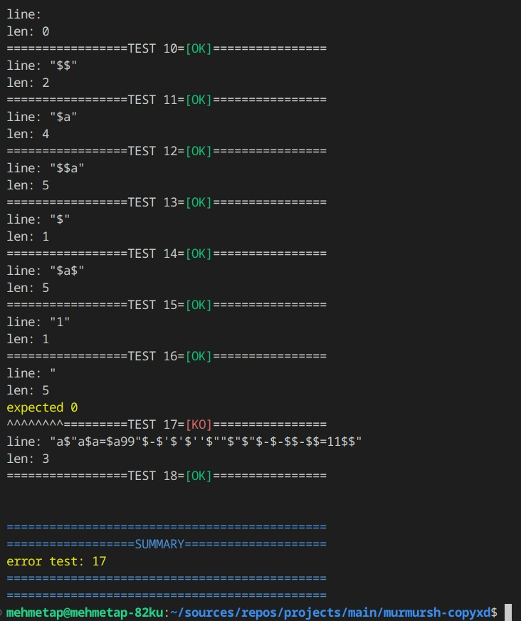

# murmurtest

---

## What is murmurtest

### tr

ChatGPT says:
>MurmurTest: Yazılım Geliştirme Sürecinde Zaman Kazandıran Bir Test Aracı
>
>MurmurTest, yazılım geliştirme sürecinde zaman kazandıran ve işlevsellik
>kontrolünü kolaylaştıran bir test aracıdır. Her düzenlemede eski işlevlerin
>bozulup bozulmadığını kontrol etmek için kullanılır. Özelleştirilebilir test
>dosyalarıyla birlikte kolayca kullanılabilir, böylece testlerinizi düzenli ve
>anlaşılır bir şekilde organize edebilirsiniz.
>
>Ayrıca, MurmurTest test hatalarını ayrıntılı bir şekilde yazdırma yeteneği sunar
>ve testleri gruplama ve özelleştirilebilir kompleks test fonksiyonları yazma
>imkanı sağlar. Bu sayede, her seferinde birçok test casesini el ile tekrar
>deneme zahmetinden kurtarır.

### en

ChatGPT says:
>MurmurTest: A Time-Saving Testing Tool in Software Development
>
>MurmurTest is a testing tool that saves time and facilitates functionality
>checks in software development. It is used to ensure whether previous
>functionalities are still intact with each edit. With customizable test files,
>it's easy to use and allows for organized and understandable test structuring.
>
>Moreover, MurmurTest provides the ability to print detailed test errors and
>allows for grouping tests and writing customizable complex test functions. This
>feature not only enhances understanding of test results but also saves you from
>the hassle of manually retesting numerous test cases each time.

---

# Usage:

<!-- > INFO: dont touch [**testing/**](./testing/) folder!
> Just include [**testing/incs/testing.h**](./testing/incs/testing.h)
> and follow the instructions below -->

You can create a custom test file like example-murmur_eval.c.
The test file must contain `void	test_main(void);` function.
Put the following in the same scope or test_main function.

!!! - legacy ways [here](#legacy-may-be-cant-support-not-recommended) (not recommended!)

- (NEW with macro!) Create test runner
```c
// create test struct
NEW_TEST_RUNNER(1)
// pass optional data
GET_TEST_RUNNER(1).my_data = get_my_data();
```

- (NEW with macro!) Create test cases
```c
NEW_TEST(1)
	NEW_GROUP("ft_strlen test", ft_strlen_test, ft_strlen_test_ko, ft_strlen_test_ok)
		{
			CASE = "ahmet",
			EXPECTED = 5
		},
		{
			CASE = "1234567",
			EXPECTED = 7
		},
	END_GROUP
	NEW_GROUP("ft_split test", ft_split_test, ft_split_test_ko, ft_split_test_ok)
		{
			CASE = "    aaaa bbbb cccc dddd    ",
			EXPECTED = (char *[]){
				"aaaa",
				"bbbb",
				"cccc",
				"dddd",
				NULL
			}
		},
		{
			CASE = "    1111 2222 3333 4444    ",
			EXPECTED = (char *[]){
				"1111",
				"2222",
				"3333",
				"4444",
				NULL
			}
		},
	END_GROUP
END_TEST
```


- example test func
```c
int		ft_strlen_test(t_test *test)
{
	t_try	*try;

	try = test->current_test->trys;
	try->result = strlen(try->try);
	if (try->result == try->expected)
		return (1);
	return (0);
}
```
- example simple ko print func
```c
void	ft_strlen_test_ko(t_test *test)
{
	t_try	*try;

	try = test->current_test->trys;
	char    *result[2] = {GREEN"[OK]"RESET, RED"[KO]"RESET};
	printf("=============== %s ============\n", test->current_test->name);
	printf("try		[ %s ]\n", (char *)try->try);
	printf(YELLOW"your		[ %zu ]\n"RESET, (size_t)(try->result));
	printf("expected	[ %zu ]\n", (size_t)(try->expected));
	printf("^^^^^^^^=========TEST %zu=%s================\n\n\n", test->test_number, result[1]);
}
```

_complex funcs [example](#complex-funcs)*_

- init and run tests
```c

	// initialize test
	// pass test struct and test cases
	EVAL_INIT(test, trys)

	// call each tests in each test groups
	EVAL_ALL(test, trys)

	// call each tests in the test group
	EVAL_GROUP(test, trys, 0) // run all tests in the group 0

	// call the test in the test group
	EVAL_TEST(test, trys, 0, 0) // run the test 0 in the group 0

	// print failed tests
	EVAL_FAILS(test)
```

#### !!! [_EXAMPLE FILE_](./murmur_eval/tests/example-murmur_eval.c) !!!

# to run:

- compile ex:

> make -C dir_of_murmur_eval re && cc [main.c] [example-murmur_eval.c] -I dir_of_murmur_eval/incs/ dir_of_murmur_eval/build/libmurmureval.a -D TEST=1 && ./a.out

- compile with -D TEST=1 to activate MURMURTEST macro

```c
int main(void){
	// code
	MURMURTEST
	// code
}
```


# The tester library all structure is like this
```c
// =============================================================================
typedef struct s_test
{
	size_t			test_number;
	size_t			test_group_num;

	struct s_tests	*current_test;
	t_list			*fails;
	t_list			*success;
	void			(*ko_msg)(struct s_test *test);
	void			(*ok_msg)(struct s_test *test);

	struct s_tests	**tests;
	void			*my_data;
}				t_test;
// =============================================================================
typedef struct s_tests
{
	char			*name;
	int				(*test_fun)(struct s_test *test);

	void			(*ko_msg)(struct s_test *test);
	void			(*ok_msg)(struct s_test *test);

	struct s_try	*trys;
}				t_tests;
// =============================================================================
typedef struct s_try
{
	void	*try;
	void	*expected;
	void	*result;
	size_t	err_bit;
}				t_try;
// =============================================================================
```

---

### example image:



\
\
### complex-funcs

- EXAMPLE VERY COMPLEX TEST FUNC
```c
int     expand_test(t_test *test)
{
	t_try	*try;

	try = test->current_test->trys;
	try->result = malloc(sizeof(void *) * 2);
    ((t_main *)(test->my_data))->line = try->try;
    ((void **)try->result)[0] = calloc(strlen(try->try), 2);
    ((void **)try->result)[1] = expander_exp(test->my_data, ((void **)try->result)[0], 0);
	try->err_bit |= (strcmp(((void **)try->expected)[0], ((void **)try->result)[0]) && 1) << 0;
	try->err_bit |= (((size_t *)((void **)try->result)[1])[0] != \
					(size_t)((void **)try->expected)[1] && 1) << 1;
	try->err_bit |= (((size_t *)((void **)try->result)[1])[1] != \
					(size_t)((void **)try->expected)[2] && 1) << 2;
    if (try->err_bit)
        return (0);
    return (1);
}
```

- EXAMPLE COMPLEX KO PRINT FUNC
```c
void	expand_test_ko(t_test *test)
{
	t_try	*try;

	try = test->current_test->trys;
	char    *result[2] = {GREEN"[OK]"RESET, RED"[KO]"RESET};
	printf("================ %s ================\n", test->current_test->name);
	printf("try		[ %s ]\n", (char *)try->try);
	if (try->err_bit & 1)
		printf(YELLOW"your		[ %s ]\n"RESET, (char *)((void **)try->result)[0]);
	printf("expected	[ %s ]\n\n", (char *)((void **)try->expected)[0]);
	if (try->err_bit & 2)
		printf(YELLOW"your		[ %zu ]\n"RESET, ((size_t *)((void **)try->result)[1])[0]);
	printf("expected	[ %zu ]\n\n", (size_t)((void **)try->expected)[1]);
	if (try->err_bit & 4)
		printf(YELLOW"your		[ %zu ]\n"RESET, ((size_t *)((void **)try->result)[1])[1]);
	printf("expected	[ %zu ]\n\n", (size_t)((void **)try->expected)[2]);
	printf("^^^^^^^^=========TEST %zu=%s================\n\n\n", test->test_number, result[1]);
}
```
\
\
\
\
\
\
\
\
#### Legacy may be cant support, not recommended!
```c
// create test struct
t_test	test;

// pass optional data
test.my_data = get_my_data();
```

#### (Legacy may be unsupport) <strike>Create test cases</strike>
```c
t_try	*trys[] =
{
	// create test group
	(t_try [])
	{
		{
			// this is not test case, this is fake test case like test-head
			// you should put it here the test funcs 
			// .try is test and result funcs, .expected is test name
			.try = &(t_fun){complex_len_test, complex_len_test_ko, complex_len_test_ok},
			.expected = "complex len test",
		},
		{
			.try = "\"a$a99-$a\"",
			.expected = (void *)6,
		},
		{
			.try = "123123'123'1\"12\"1",
			.expected = (void *)13,
		},
		{
			.try = "\"a$\"a$a=$a99\"$-$'$'$''$\"\"$\"$\"$-$-$$-$$=11$$\"",
			.expected = (void *)3,
		},
		{
			.try = NULL,
			.expected = NULL,
		}
	},

	// create another test group
	(t_try [])
	{
		{
			// this is not test case, this is fake test case like test-head
			// you should put it here the test funcs 
			// .try is test and result funcs, .expected is test name
			.try = &(t_fun){expand_test, expand_test_ko, expand_test_ok},
			.expected = "dquote test",
		},
		{
			.try = "\"a$a=$a99\"$-$'$'$''$\"\"$\"$\"$-$-$$-$$=11$$",
			.expected = &(void *[3]){
				"a0000=",
				(void *)10,
				(void *)6
			}
		},
		{
			.try = "\"$a-$a\"",
			.expected = &(void *[3]){
				VAR"-"VAR,
				(void *)7,
				(void *)(VAR_LEN + 1 + VAR_LEN)
			}
		},
		{.try = NULL, .expected = NULL}
	},

	// create another test group
	(t_try [])
	{
		{
			// this is not test case, this is fake test case like test-head
			// you should put it here the test funcs 
			// .try is test and result funcs, .expected is test name
			.try = &(t_fun){join_all_test, join_all_test_ko, join_all_test_ok},
			.expected = "join all test",
		},
		{
			.try = "'$a'\"''$a''\"\"'$a'\"\"  '$a' $ $a \"\"  '$'  \"\"''\"'\"$a\"'\"$_\"'$_'-=$$\"$a\"$''$$$-$'a'4\"$a $a\"a'$a''a'\"v$a$av$\"$' ''$'a'\"$a\"'\"''\"31",
			.expected = "$a''0000'''0000'  '0000' $ 0000   '$'  ''\"$a\"./program$_-=$$0000$$$$-$a40000 0000a$aav0000$$ $a\"$a\"''31"
		},
		{
			.try = "'\"  $ $ $a \"''$'\"\"''\"'\"99\"'\"\"$_\"\"'$_'-=$$\"'$a'\"$''$$$-$'a'4\"'$a $'a\"a'$a''a'\"v$'a$'av$\"$' ''$'a'\"'$'a\"'\"''\"31\"",
			.expected = "\"  $ $ $a \"$'99'./program'./program'-=$$$a$''$$$-$'a'4$a $aa'0000''a'v$a$av$$' ''$'a'$a'31"
		},
		{
			.try = NULL,
			.expected = NULL,
		}
	},

	// create another test group
	(t_try [])
	{
		{
			// this is not test case, this is fake test case like test-head
			// you should put it here the test funcs 
			// .try is test and result funcs, .expected is test name
			.try = &(t_fun){parser_test, parser_test_ko, parser_test_ok},
			.expected = "join all2 test",
		},
		{
			.try = "$d\"aaaa\"$a$b$c' xxxx'",
			.expected = (char *[]){
				"33",
				"33aaaa000011",
				"1122",
				"22",
				"22 xxxx",
				NULL
			}
		},
		{
			.try = NULL,
			.expected = NULL,
		}
	},

	NULL,
};
```

This work © 2023 by murmurlab is licensed under CC BY-SA 4.0. To view a copy of this license, visit http://creativecommons.org/licenses/by-sa/4.0/
